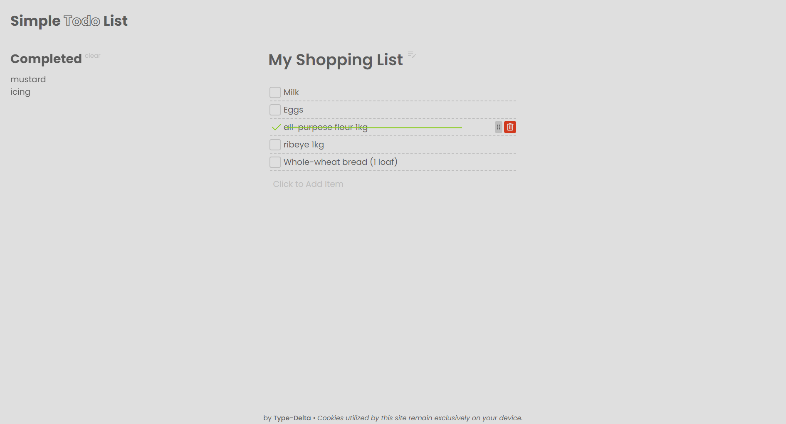

> for T. Job, here are the checksum: `MIIC1327 id:6511130003`

# Simple TODO list

it just a simple to-do list

### why

this project starts as a University Homework, but I poured a bit too much effort into it,
so I thought why not make it a quick project.
That way maybe it can benefit someone else aside from me getting a few points from it :).

You can use this project as a starting point, template or if you are new to this kind of stuff,
maybe you would learn a thing or two from it.

> **DISCLAIMER**: I'm still a learner and my code is probably trash, but hey, it works.

## Features

- auto save and load TODO from cookies

   if `index.html` is opened directly from the file system, it may not work due to the browser's security policy.
- add, remove, edit, mark as done and reorder of TODO
- list of completed TODO
- editing of TODO's title
- a sprinkle of animations powered by [gsap](https://gsap.com)

## How to use

you can open `index.html` directly from the file system or use a local server to serve the files.

if you have Visual Studio Code, you can use [Live Server](https://marketplace.visualstudio.com/items?itemName=ritwickdey.LiveServer) extension to serve the files.

